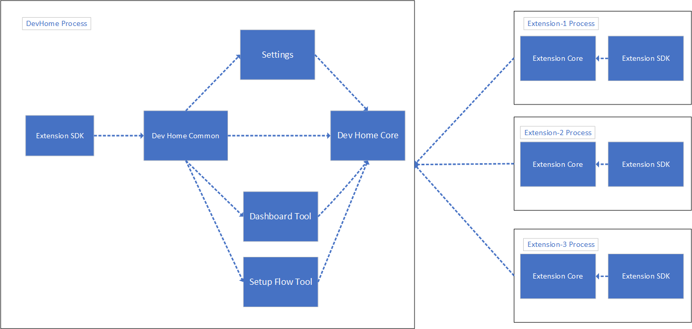
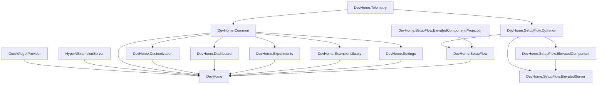

# Architecture

Dev Home has a modular architecture that consists of multiple components. These components are:

1. Dev Home Core
1. Dev Home Common
1. Settings
1. Tools
1. Extensions

A more detailed look at how the projects are related:

## Dev Home Core

Dev Home Core is the central part of Dev Home where all the components come together. The functions it performs include:

- Defining the packaging details
- Running the main logic including managing lifecycle, managing activations, and creating the main window
- Creating UI for the shell page and allowing navigation among tools
- Finding all the available tools and allowing them to be displayed
- Starting and managing the lifecycle of extensions

## Dev Home Common

The Dev Home Common component contains code that is shared among the tools, core, and settings components. It also imports libraries that are used across Dev Home. One such library is the **Dev Home Extension SDK** used to get references to out-of-process extensions.

Dev Home Common also provides telemetry functionality.

## Settings

This is a special component that acts similarly to a tool but isn't actually a tool. The Settings component, like other tools, consumes the Common project and is used by Dev Home Core. It manages user preferences across all tools and extensions.

## Tools

The tools are a set of functionalities that are integrated within Dev Home's codebase. They are designed to provide specific capabilities or features to Dev Home. They live as their own component but run in the same process as Dev Home and can communicate with each other and the core component through Dev Home's API.

These tools can use the APIs in the extension SDK to get data or functionality from the extensions.

Learn more about [tools](./tools/readme.md).

Dev Home currently has the following tools:

- [Dashboard](./tools/Dashboard.md)
- Setup flow
- Extensions Library
- [Windows customization](../tools/Customization/DevHome.Customization/Customization.md)
- Utilities

## Extensions

Extensions are separate packages living as out-of-process components that provide functionality and data used by the Core component and the tools. These extensions mostly live outside of Dev Home's core codebase and they interact with Dev Home through a well-defined API or protocol.

Extensions can be developed by third-party developers or by Dev Home's core development team. These extensions allow Dev Home to be extended without modifying its core codebase.

Learn more about [writing an extension](./extensions/readme.md).
