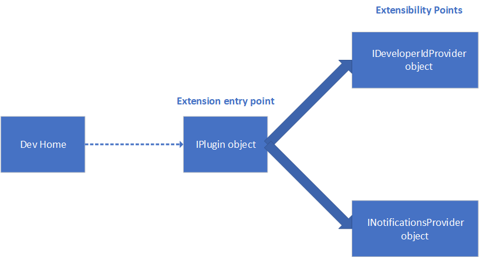
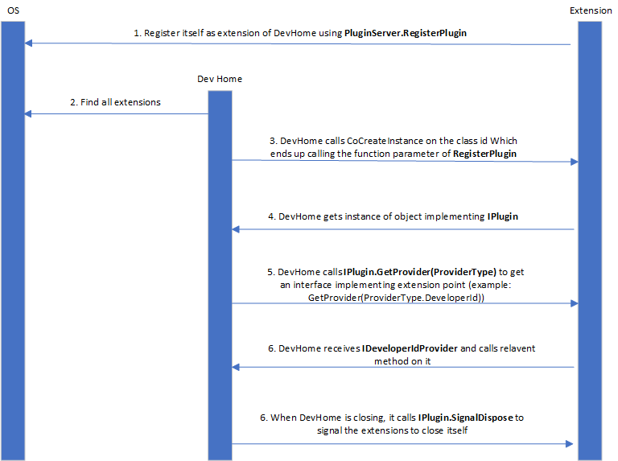

# Extensions

Dev Home is an app extension host which uses [out-of-process COM](https://learn.microsoft.com/samples/dotnet/samples/out-of-process-com-server/) to talk to external COM Server processes that declare themselves to be extensions of Dev Home.

Dev Home currently supports extending two interfaces through the Extension SDK. In addition, extensions can provide widgets to Dev Home using [Widget providers](https://learn.microsoft.com/windows/apps/develop/widgets/widget-providers).

## Extension basics

Each extension lives as a separate, packaged Windows application and manages its own lifecycle. The extension applications declare themselves to be extensions of Dev Home through the [manifest file](#extension-manifest).

An extension can provide functionality for one or more extensibility points. Currently, Dev Home supports two extensibility points:

- Developer IDs: Allow developers to sign in and out of a service by implementing the [`IDeveloperIdProvider`](#ideveloperidprovider) interface.
- Repositories: Allow developers to get available repositories associated with their Developer IDs or parse repositories from URLs and clone them by implementing the [`IRepositoryProvider`](#irepositoryprovider) interface.

Read more about [Provider interfaces](#provider-interfaces) below. Each extension also must have a class that implements `IExtension`. DevHome needs to create an instance of this class. The GUID of this class must be reflected in the manifest. See [Sample Extension](../../extensions/SampleExtension/SampleExtension.cs)



## Extension manifest

The `package.appxmanifest` file must define a COM Server (which includes the class ID of the `Extension` class) and `AppExtension` properties declaring extension information.

```xml
<Extensions>
  ...
  <com:Extension Category="windows.comServer">
    <com:ComServer>
      <com:ExeServer Executable="ExtensionName.exe" Arguments="-RegisterProcessAsComServer" DisplayName="Sample Extension">
        <com:Class Id="<Extension Class GUID>" DisplayName="Sample Extension" />
      </com:ExeServer>
    </com:ComServer>
  </com:Extension>

  <uap3:AppExtension Name="com.microsoft.devhome"
                     Id="YourApplicationUniqueId"
                     PublicFolder="Public"
                     DisplayName="Sample Extension"
                     Description="This is a sample description.">
    <uap3:Properties>
      <DevHomeProvider>
        <Activation>
          <CreateInstance ClassId="<Extension Class GUID>" />
        </Activation>
        <SupportedInterfaces>
          <DeveloperId />
          <Repository />
        </SupportedInterfaces>
      </DevHomeProvider>
    </uap3:Properties>
  </uap3:AppExtension>
</Extensions>
```

## Provider Interfaces

### IDeveloperIdProvider

Developer ID-related scenarios can be extended by:
- Implementing `IDeveloperIdProviderInterface`
- In the manifest, declaring `IDeveloperId` as one of the supported interfaces

```cs
public interface IDeveloperIdProvider : global::System.IDisposable
{
  string GetName();
  global::System.Collections.Generic.IEnumerable<IDeveloperId> GetLoggedInDeveloperIds();
  global::Windows.Foundation.IAsyncOperation<IDeveloperId> LoginNewDeveloperIdAsync();
  void LogoutDeveloperId(IDeveloperId developerId);
  IExtensionAdaptiveCardSession GetLoginAdaptiveCardSession();
  event global::System.EventHandler<IDeveloperId> LoggedIn;
  event global::System.EventHandler<IDeveloperId> LoggedOut;
  event global::System.EventHandler<IDeveloperId> Updated;
}
```

```cs
public interface IDeveloperId
{
  string LoginId();
  string Url();
}
```

### IRepositoryProvider

Repository-related scenarios can be extended by:
- Implementing the `IRepositoryProvider` interface
- In the manifest, declaring `IRepository` as one of the supported interfaces

```cs
public interface IRepositoryProvider : global::System.IDisposable
{
  global::Windows.Foundation.IAsyncOperation<global::System.Collections.Generic.IEnumerable<IRepository>> GetRepositoriesAsync(IDeveloperId developerId);
  
  global::Windows.Foundation.IAsyncOperation<IRepository> ParseRepositoryFromUrlAsync(global::System.Uri uri);
  
  string DisplayName { get; }
}
```

```cs
public interface IRepository
{
  [global::Windows.Foundation.Metadata.Overload(@"CloneRepositoryAsync")]
  global::Windows.Foundation.IAsyncAction CloneRepositoryAsync(string cloneDestination, IDeveloperId developerId);

  [global::Windows.Foundation.Metadata.Overload(@"CloneRepositoryAsync2")]
  global::Windows.Foundation.IAsyncAction CloneRepositoryAsync(string cloneDestination);
  
  string DisplayName { get; }
  
  bool IsPrivate { get; }
  
  global::System.DateTimeOffset LastUpdated { get; }
  
  string OwningAccountName { get; }
}
```

## Sequence diagram



## Runtime logic

At startup, Dev Home iterates through the app catalog looking for any extensions and adds them to a dictionary.

```cs
private readonly IDictionary<string, IReadOnlyList<AppExtension>> _extensions = new Dictionary<string, IReadOnlyList<AppExtension>>();
```

Any internal tools can retrieve a read-only list of extensions for a given extension point as follows:

```cs
var extensionService = App.GetService<IExtensionService>();
var extensions = extensionService.GetExtensions("widget");
```
