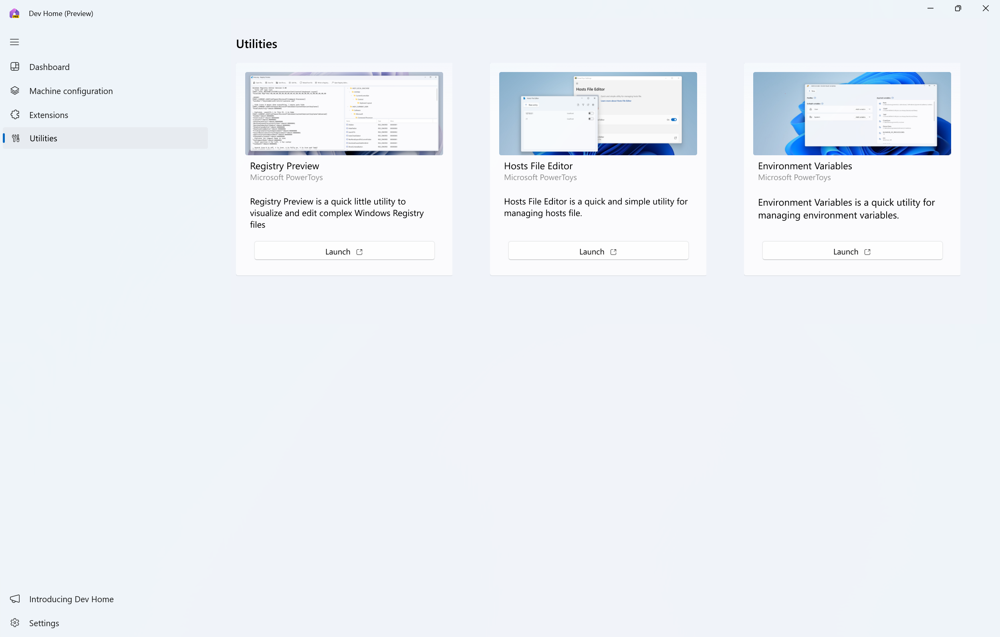
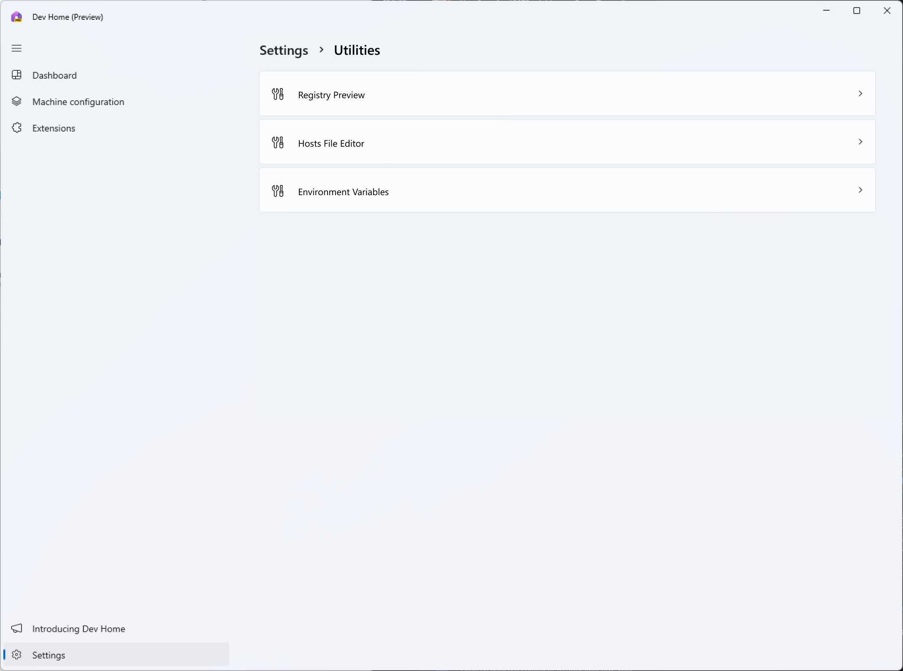
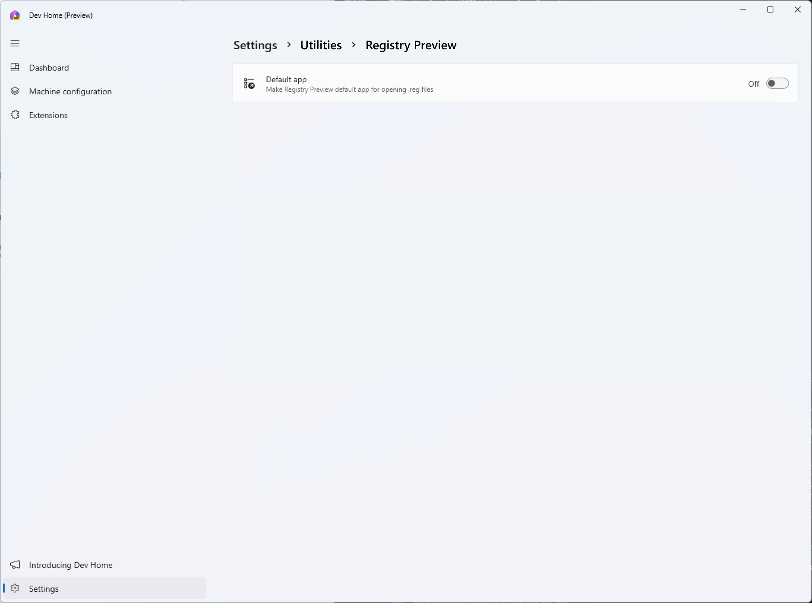
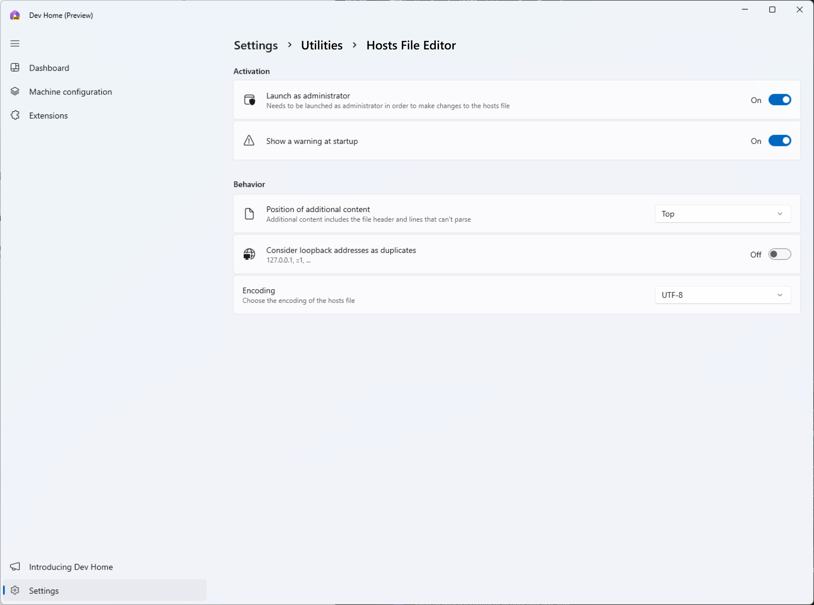
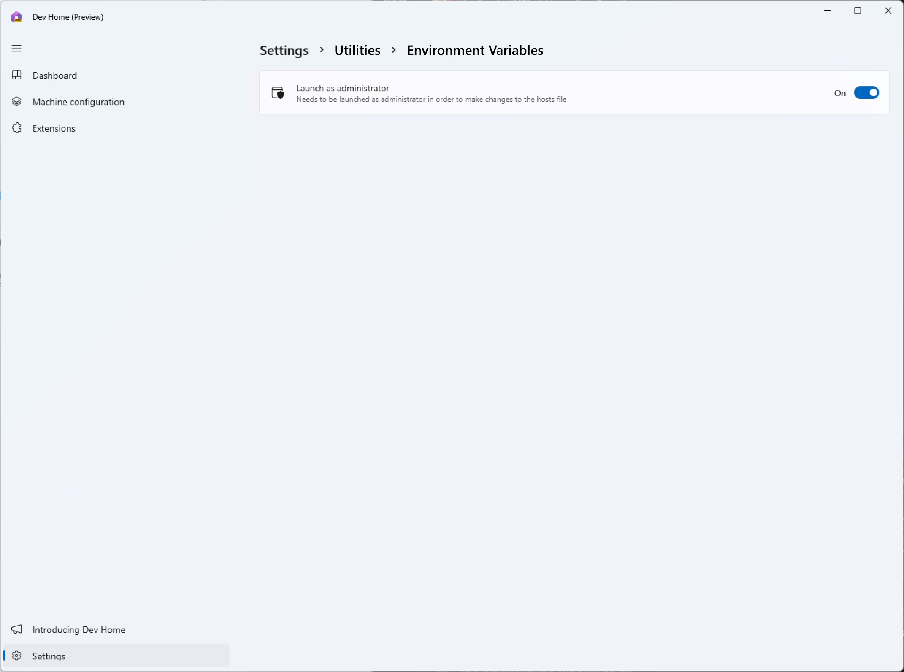
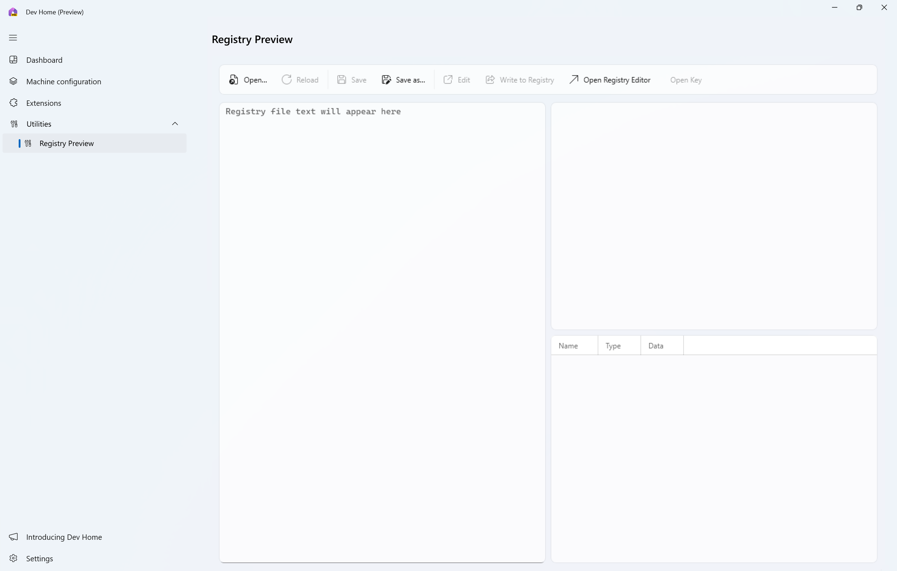

# Add some PowerToys utilities

## 1. Overview

### 1.1 Establish the Problem

Dev Home is intended to be a centralized location for developers to help them stay productive on Windows. One feature we had been thinking of is adding helpful utilities into Dev Home for quick and easy access.

### 1.2 Introduce the Solution

[PowerToys](https://github.com/microsoft/powertoys) has created a few utilities with the original intent of migrating them into Dev Home. These utilities include Registry Preview, Hosts File Editor, and Environment Variables. We can add these utilities into Dev Home as the "stable" versions of these tools, while maintaining their "preview" versions in PowerToys. By adding these utilities to Dev Home, we can provide developers with more value out of the box in Windows while also provide more awareness to PowerToys.

### 1.3 Rough-in Designs for initial release

## 2. Goals & User Cans

### 2.1 Goals

1. Add additional functionality to Dev Home
2. Provide helpful inbox utilities to the user
3. Bring awareness to PowerToys
4. Provide stable versions of PowerToys utilities
5. Provide a surface within Dev Home for additional utilities outside of PowerToys

### 2.2 Non-Goals

1. This feature is not intended to replace PowerToys
2. This feature is not intended to deprecate existing PowerToys

### 2.3 User Cans Summary Table

| No. | User Can | Pri |
| --- | -------- | --- |
| 1 | User can launch Registry Preview in a separate window. | 0 |
| 2 | User can launch Hosts File Editor as administrator in a separate window. | 0 |
| 3 | User can launch Hosts File Editor with read-only permissions in a separate window. | 0 |
| 4 | User can launch Environment Variables as administrator in a separate window. | 0 |
| 5 | User can launch Environment Variables with read-only permissions in a separate window. | 0 |
| 6 | User can modify Registry Preview's settings from Dev Home. | 0 |
| 7 | User can modify Hosts File Editor's settings from Dev Home. | 0 |
| 8 | User can modify Environment Variable's settings from Dev Home. | 0 |
| 9 | User can launch Registry Preview from the command line. | 1 |
| 10 | User can launch Hosts File Editor from the command line. | 1 |
| 11 | User can launch Environment Variables from the command line. | 1 |
| 12 | User can launch Registry Preview from Start menu. | 1 |
| 13 | User can launch Hosts File Editor from Start menu. | 1 |
| 14 | User can launch Environment Variables from Start menu. | 1 |
| 15 | User can launch Registry Preview as an embedded page in Dev Home | 1 |
| 16 | User can launch Hosts File Editor as an embedded page in Dev Home | 2 |
| 17 | User can launch Environment Variables as an embedded page in Dev Home | 2 |

## 3. User Stories

### 3.1 User story - Launching Registry Preview in a separate window

#### Job-to-be-done

Pam wants to launch Registry Preview from Dev Home in order to look at her registry files.

#### User experience

1. Pam opens Dev Home
2. Pam navigates to the Utilities page
3. Pam clicks Launch on the Registry Preview card
4. Registry Preview is launched in a separate window on Pam's desktop

#### Golden paths (with images to guide)

#### Edge cases

1. Pam also has PowerToys installed. This shouldn't cause a conflict on the machine because the utilities should be registered separately.

### 3.2 User story - Launching Hosts File Editor or Environment Variables as administrator in a separate window

#### Job-to-be-done

Sean wants to launch Hosts File Editor from Dev Home in order to edit his Hosts file. This user experience is the same for Environment Variables.

#### User experience

1. Sean opens Dev Home
2. Sean navigates to Settings > Utilities > Hosts File Editor
3. Sean toggles on "Launch as administrator"
4. Sean navigates to the Utilities page
5. Sean clicks Launch on the Hosts File Editor card
6. A UAC prompt appears on Sean's screen
7. Sean clicks Yes
8. Hosts File Editor is launched as Administrator in a separate window on Sean's desktop

#### Golden paths (with images to guide)

#### Edge cases

1. Sean doesn't have admin rights. This would launch Hosts File Editor and/or Environment Variables with read-only permissions.
2. Sean also has PowerToys installed. This shouldn't cause a conflict on the machine because the utilities should be registered separately.

### 3.3 User story - Using Registry Preview from within Dev Home

#### Job-to-be-done

Tina wants to launch use Registry Preview from inside Dev Home in order to look at her registry files.

#### User experience

1. Tina opens Dev Home
2. Tina expands the navigation item for Utilities
3. Tina navigates to the Registry Preview page
4. Tina sees the Registry Preview tool embedded within a page in Dev Home

#### Golden paths (with images to guide)

#### Edge cases

1. Tina also has PowerToys installed. This shouldn't cause a conflict on the machine because the utilities should be registered separately.

## 4. Requirements

### 4.1 Functional Requirements

#### Summary

This feature will deliver stable versions of Registry Preview, Hosts File Editor, and Environment Variables from PowerToys with Dev Home. In V1, the user will be able to launch these utilities in separate windows from the new Utilities page. These utilities will all have settings within Dev Home as well. V2 will provide an embedded experience for Registry Preview inside Dev Home, so users can use this utility without leaving Dev Home. V3 will have pages for all three of these utilities if possible - Hosts File Editor and Environment Variables require Administrator, which may pose a technical challenge for having them as embedded experiences.

#### Detailed Experience Walkthrough

##### V1 of each utility being launchable as separate windows from the Utilities page

##### V1 settings page

##### V1 utilities settings page

##### V1 Registry Preview settings page

##### V1 Hosts Files Editor settings page

##### V1 Environment Variables settings page

##### V2 of Registry Preview being embedded as a page inside Dev Home

#### Detailed Functional Requirements

[comment]: # Priority definitions: P0 = must have for WIP (minimum initial experiment), P1 = must have for GA, P2 = nice to have for GA, P3 = GA+

| No. | Requirement | Pri |
| --- | ----------- | --- |
| 1 | Registry Preview (stable) is delivered with Dev Home | 0 |
| 2 | Environment Variables (stable) is delivered with Dev Home | 0 |
| 3 | Hosts File Editor (stable) is delivered with Dev Home | 0 |
| 4 | A Utilities page is created with links to launch Registry Preview, Environment Variables, and Hosts File Editor | 0 |
| 5 | Registry Preview is added to the PATH to allow for launching from the command line. | 1 |
| 6 | "Preview (stable)" is an option in the context menu when right clicking on a registry file. | 1 |
| 7 | Environment Variables is added to the PATH to allow for launching from the command line. | 1 |
| 8 | Hosts File Editor is added to the PATH to allow for launching from the command line. | 1 |
| 9 | Registry Preview is discoverable and launchable from the Start menu. | 1 |
| 10 | Environment Variables is discoverable and launchable from the Start menu. | 1 |
| 11 | Hosts File Editor is discoverable and launchable from the Start menu. | 1 |
| 12 | Registry Preview has an embedded page in Dev Home | 1 |
| 13 | Environment Variables has an embedded page in Dev Home | 2 |
| 14 | Hosts File Editor has an embedded page in Dev Home | 2 |
