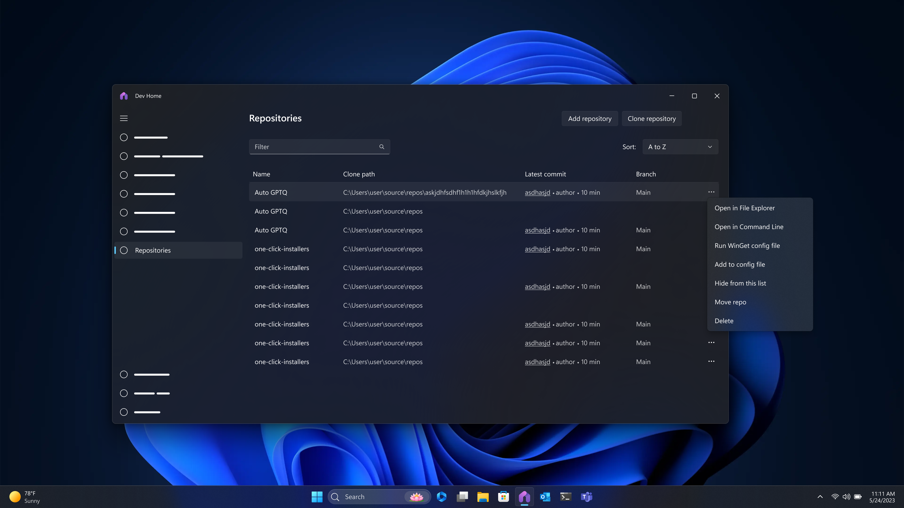

# Repository management in Dev Home

## 1. Overview

### 1.1 Establish the Problem

Today you can clone repositories onto your machine through Dev Home, but afterwards, there is no way to check which repos are cloned already, recently updated, or do any sort of management or launching of those repos.

### 1.2 Introduce the Solution

The proposed experience is a new page to manage your cloned repositories on your machine through Dev Home. Through this view you can see the list of repositories you have cloned through Dev Home, point Dev Home at repos you may have cloned outside of Dev Home, and any new repos you clone through Dev Home are automatically added to this list. You will be able to see relevant information, take actions on the repos like launching, moving, or running detected configuration files.

### 1.3 Rough-in Designs

## 2. Goals & User Cans

### 2.1 Goals

1. Provide users with a way to see and manage all repos they have cloned on their machine 

### 2.2 Non-Goals

1. We do not want to become another version control or repository hosting service 
2. We do not want to become a file editing/management system (if a user wants to view  or edit the contents of a file or folder in a repo, they need to choose to launch their repo management tool, IDE, etc.) 
3. We do not want to do ‘repo actions’ (e.g. push/pull)

### 2.3 User Cans Summary Table

| No. | User Can | Pri |
| --- | -------- | --- |
| 1 | User can see all repos they have cloned via Dev Home  | 0 |
| 2 | User can see the repo name and current clone path  | 0 |
| 3 | User can ‘open in File Explorer’ with any repo  | 0 |
| 4 | User can ‘open in command line’ to open the default command line tool  | 0 |
| 5 | User can opt to clone a new repo, which takes the user to the ‘quick step’ of cloning a repo in machine configuration  | 0 |
| 6 | User can point to file location of existing (cloned) repos on their machine to add to their list of known cloned repos  | 0 |
| 7 | User can see and run configuration files associated with a given repo  | 0 |
| 8 | User can move or delete a repo  | 0 |

## 3. User Stories

### 3.1 User story - Cloning and setting up repos on a new machine

#### Job-to-be-done

A developer is setting up their machine for a new project. They need to clone multiple repos and want to keep track of what they have done already for this new project and get started with development as soon as possible

#### User experience

1. Developer goes through the e2e machine configuration flow and clones repos and installs applications
2. Set up completes and the developer can go to the repo management page from the summary page
3. Developer goes to the repo management page and can see the repos that they just cloned.
4. Developer selects a repo to set up by running it's associated configuration file. 

### 3.2 User story - Add existing repos

#### Job-to-be-done

A developer is established on their machine but would like to start using Dev Home to keep track of all their repos on their machine. 

#### User experience

1. Developer goes to the repo management page in Dev Home. 
2. Developer selects to 'add repositories'.
3. File explorer is launched and the developer navigates to their repositories folder.
4. All repositories within the folder are added to the list in Dev Home. 

## 4. Requirements

### 4.1 Functional Requirements

#### Summary

The repository managment page will allow users to maintain a list of all cloned repos on their machine, launch them, complete their set up process, and utilize their repos within Dev Home experiences. 

#### Detailed Functional Requirements

| No. | Requirement | Pri |
| --- | ----------- | --- |
| 1 | List out all repositories the user has cloned via Dev Home   | 0 |
| 2 | When a user clones new repositories via the set up flow, add the repositories to the list   | 0 |
| 3 | Repository metadata includes repository name and clone path  | 0 |
| 4 | A repository can be opened with file explorer to view the file location | 0 |
| 5 | There is an option to clone a new repository, which takes the user to the clone repo flow in machine configuration  | 0 |
| 6 | If there is a WinGet configuration file associated with a repository, it can be viewed or run | 0 |
| 7 | The user can browse/point Dev Home to a file location to add existing cloned repos  | 0 |
| 8 | A repository can be moved or deleted | 1 |
