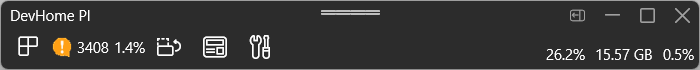
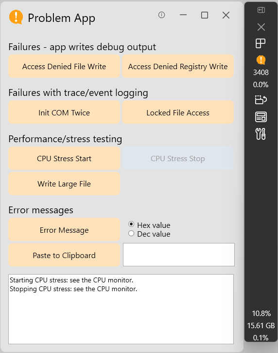
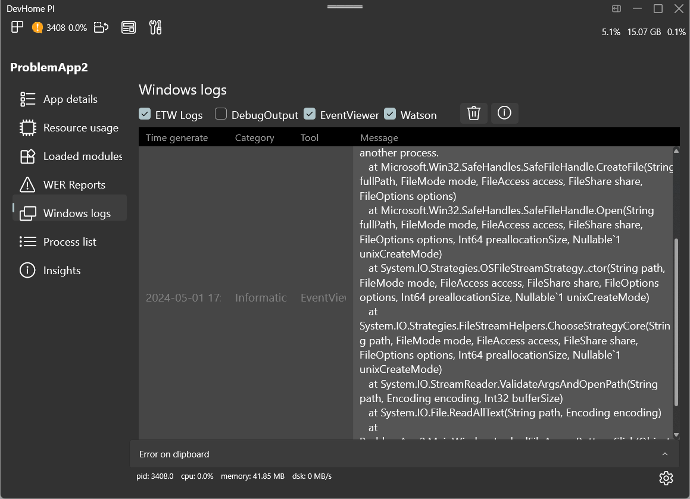
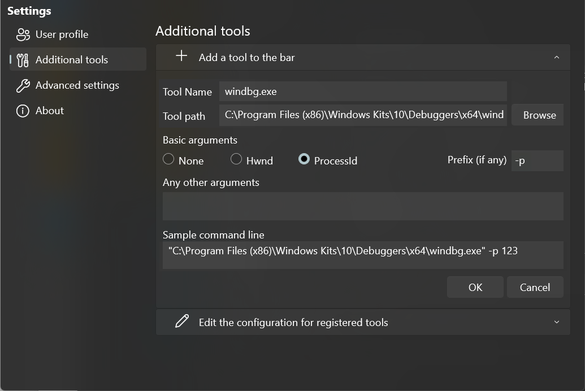
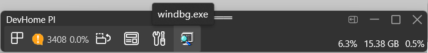
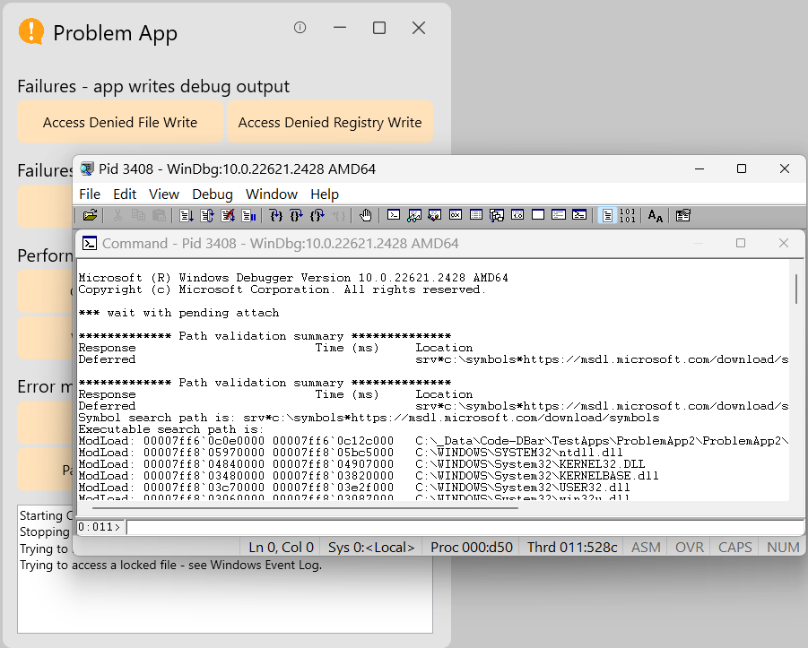

# Dev Home Feature Exploration: Dev Home PI

## Please Provide Feedback & Ideas!

Please let us know what you think about this feature by commenting on this issue! We'd love to hear your ideas and feedback! We will share out our list in the near future but want to hear from you first so we don't influence your feedback.

Let us know:

- What do you like about the feature?
- What do you think is missing/what could improve this feature?
- Is there anything you would like to see added to the project definition?

## Overview

This issue outlines a suggested new Dev Home feature: Dev Home Project Ironsides (**Dev Home PI**), which allows developers to "peek under the hood" of Windows to better understand how their app interacts with Windows. It gathers data on the app's context, including events, crash dumps from Windows Error Reporting (WER), Event Tracing for Windows (ETW) reports and so on. It can analyze the data and help to identify root causes. On top of that, it is entirely configurable and enables the developer to incorporate any additional external tools - Dev Home PI can then feed inputs to those tools (such as the target process ID or window handle), and collect and analyze outputs. Note that any data collected remains on the device, and is not sent anywhere.

### The Problem

Developers are skilled at identifying issues with their apps, but the process is not always very streamlined. There are multiple data sources that can be leveraged (event logs, trace logs, crash dumps, etc) and each source typically has a different tool for managing and exposing the data. Also, during app development, it is common for a developer to use multiple tools: their primary IDE, such as Visual Studio or VSCode, plus debugging tools such as WinDbg and tools from the SysInternals suite, and many others. While a lot of tools are commonly used, each developer also has her own requirements and preferences - so the range of tools is large, and changes over time. There are many tools available that could help diagnose issues, many of which developers might not be aware of, and Dev Home PI will be able to make tool suggestions for specific scenarios.

### Project Definition

Dev Home PI doesn't aim to replace any of the many existing developer and diagnostic tools - instead it aims to make using these tools easier. There are 3 key tenets:

- Maximize the amount of relevant data that is made available, filtered to the target app of interest, and parsed where necessary to make it more easily consumable.
- Provide a level of analysis over all this data, aiming to identify issues, so that the developer doesn't have to do this analysis herself. 
- Provide some basic diagnostic functionality within the tool, but also leverage any other tool that the developer chooses to incorporate within Dev Home PI.

### Goals

| #    | Goal                                                         |
| ---- | ------------------------------------------------------------ |
| 1    | Dev Home PI reduces toil for developers and allows them to get into their flows quickly and seamlessly |
| 2    | Dev Home PI helps developers identify issues with their apps, and root-cause any problems. |
| 3    | Dev Home PI helps developers to use additional diagnostic tools, filtering and scoping where needed, so that the developer can focus on the key issue for their app. |

### Roadmap

| Phase | Description                                                  |
| ----- | ------------------------------------------------------------ |
| Crawl | In this phase, Dev Home PI is focused on developer scenarios. Dev Home PI will explicitly expose all the raw data it gathers from various sources about the target app, on the assumption that developers might want to drill down into this directly. The level of analysis layered on top of this will be minimal in this initial phase. |
| Walk  | Over time, Dev Home PI's knowledge base will be enhanced and extended, and this will allow the level of problem analysis, pattern-matching and solution identification to become more comprehensive. The tool will become increasingly usable by power-users and other non-developer users. |
| Run   | Eventually, Dev Home PI's problem analysis and feature set will become sophisticated enough that it will be usable by all users, whatever their level of technical experience. |

### User Scenarios (Crawl phase)

#### Targeting a problem app

1. A developer has an app active in the foreground; she hits the Dev Home PI hotkey (Windows+Shift+D) to invoke Dev Home PI.

2. The Dev Home PI toolbar immediately shows up, and finds the foreground app (if there is one). If there’s no app in the foreground, the Dev Home PI toolbar still comes up, and it offers a list of running processes, from which the developer can identify the process she wants to target.

3. Meanwhile, in the background, Dev Home PI is gathering runtime context data, including overall machine resource (CPU, memory, disk, network) usage levels, system information (OS version, basic machine specifications, etc).

4. With the target process identified, using its own internal functionality, Dev Home PI gathers context data specific to the target app, including:

   1. Static data such as app name, app type, version, executable path or Application User Model ID (AUMID), the list of dependencies and their versions.
   2. Dynamic data such as modules loaded, resource usage, ongoing ETW entries.
   3. Historical data such as Event Log entries and WER reports.

5. Dev Home PI can surface all the data it finds in the UI, so that the developer can examine this herself if she wishes.

6. Given the initial data it has gathered, Dev Home PI can perform a first-pass analysis on the state of the machine and the state of this app, and start to identify issues. This is done by searching its internal knowledge-base for any key items it has found in the current data. 

   1. In the initial releases, the knowledge-base will be simple and small. The level of analysis that Dev Home PI can perform will therefore be limited. For example, error codes, exception types, error messages, any hex or decimal values that match known errors, and the like. 

   2. For a given exception type or error code, the knowledge-base will include the known scenarios when that exception/error occurs, and any known (documented) mitigations or solutions.

7. Dev Home PI can make use of standard Windows features, such as the Event log, WER reports, and ETW traces.

   1. Dev Home PI doesn’t need to show the UI from these system tools – instead, it can gather the filtered set of data, aggregate and format the results, and present this in a consolidated view.

   2. When using such system tools, Dev Home PI can filter for the current scenario (such as the current process or app name). So, for example, it can gather entries from the system’s various Event logs that are specifically related to the target app.

   3. In addition to filtering, Dev Home PI also has the ability to parse the outputs of these known system tools.

8. The user can identify additional tools she already has installed, to register these with Dev Home PI, such that Dev Home PI can activate these tools. 

   1. Registration can include how to activate the tool – specifically, how to scope the tool to the current scenario. For example, whether the tool takes in a process ID or window handle in its command-line arguments.

   2. When it activates an external tool, Dev Home PI can provide command-line arguments (or protocol parameters, COM object-model method parameters, etc) to scope the tool to the current scenario, passing in the target app’s process ID or window handle.

## User flows and UI

This section contains user flows with design concepts for the Dev Home PI feature. These flows/concepts are not final - we'd love to hear your feedback on these!

#### Start with minimal toolbar

The primary use case is when the user is working with an app, and that app has a main window open in the foreground. When she invokes Dev Home PI, the tool will find the foreground app, and render as a minimal toolbar by default, laid out horizontally, and centered at the top of the user's primary (or only) screen. 

If desired, the user can dock the Dev Home window to the target app window (and laid out vertically):

The user can undock Dev Home PI at any time, and redock at will. The bar orientation can be toggled between vertical and horizontal.

In the docked case, if the target window is minimized, then Dev Home PI is also minimized. If the target window is maximized, then Dev Home PI is undocked and free-floating - if the user subsequently restores the target window, the tool will redock.

Dev Home PI can also be invoked when there is no foreground app of interest. For example, if the user wants to work with a process that is headless. In this case the user can select a process from Dev Home PI's process list. The tool also supports the case where the user is not targeting any process at all, and either wants to examine the system overall, or wants to start a target app sometime later.

#### Expand to full window mode

At any time, the user can expand from the collapsed minbar mode to a full windowed mode. This will show all available functionality, and from here the user can navigate to all available data that Dev Home PI has gathered. In this mode, Dev Home PI offers a left-hand navigation list, which the user can use to navigate to any of the tabs.

The collection of tabs is evolving, but here's what we have right now:

| Tab            | Description                                                  |
| -------------- | ------------------------------------------------------------ |
| App details    | Static details of the app, including its name, executable path (or AUMID), binary type (x64, x86, ARM64), whether MSIX-packaged or not, windowing framework or app-model technology used, etc. |
| Resource usage | Dynamic resource usage, including CPU, GPU, memory, disk and network usage. |
| Loaded modules | All the DLLs and other modules loaded by this instance of the target app, including their version information, full path, etc. |
| WER reports    | When an app crashes, Windows typically creates a crash dump and composes a report including this information. These Windows Error Reporting (or, Watson) reports are listed here for the target app. |
| Windows logs   | This is a consolidated report of existing and ongoing WER/Watson reports and Event log entries for the current app. In addition, any ongoing debug output or trace output (captured via Error Tracing for Windows, or ETW) is also surfaced here. |
| Process list   | A list of all running processes. You can select a process from the list to be your target for analysis if you wish. |
| Insights       | This tab shows a collection of any first-pass analysis that Dev Home PI could determine, based on the data that is has gathered for the target app. |

#### External tools

The UX for adding an external tool can be accessed via Dev Home PI’s settings UI. At any time, the user can "register" a tool with Dev Home PI. A "tool" in this context is any app the user wants to incorporate within Dev Home PI's toolbar.

The user can register any app of any kind with Dev Home PI, identified by path to the executable, or the AUMID of the app if it's packaged. When you register a tool in this way, Dev Home PI will add it to its toolbar:

When registering a tool, the user can specify the arguments to be passed into the tool when it is invoked, and Dev Home PI will record these arguments for future invocations. This configuration is internal to Dev Home PI, and doesn't affect how the tool is invoked outside Dev Home PI. 

The user can unregister an external tool at any time (this doesn't uninstall the tool, or affect it in any other way). This feature enables the user to collect all her favorite diagnostic tools in one place, and to configure them for use in targeted diagnostic scenarios.

